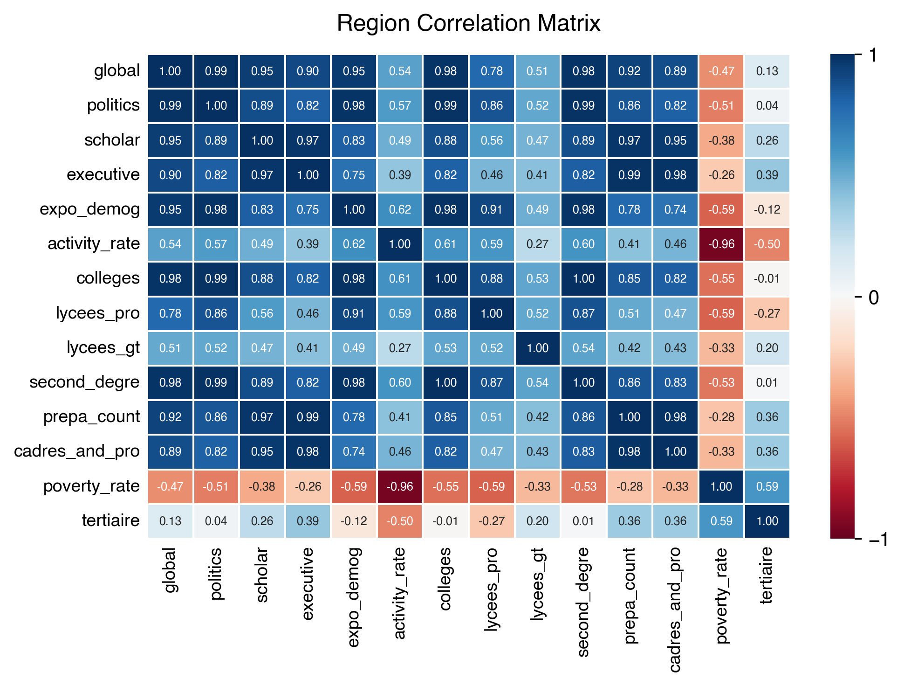
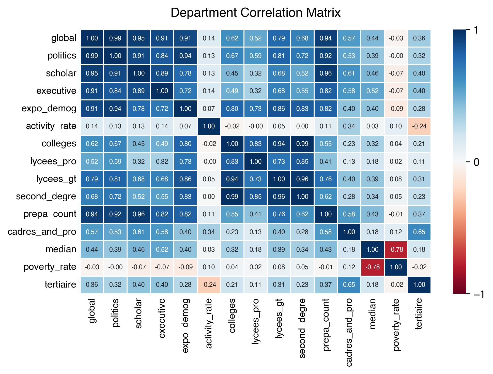
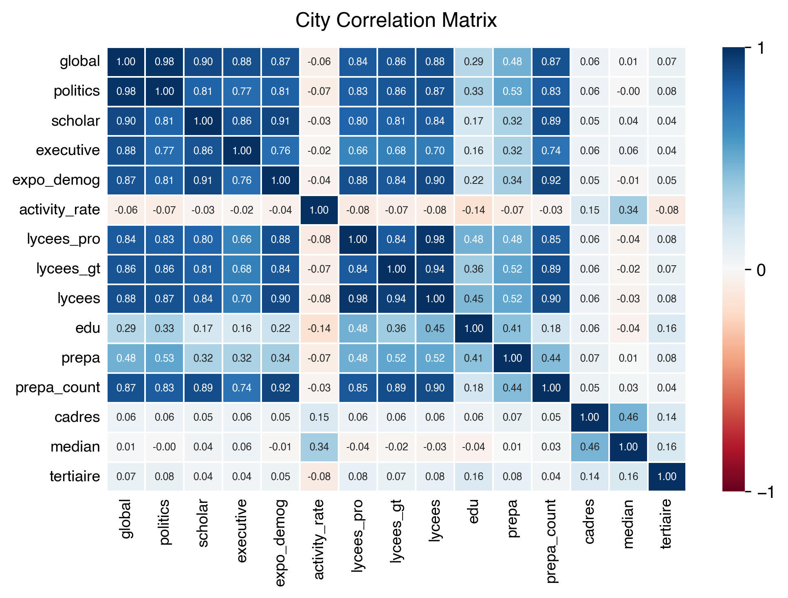
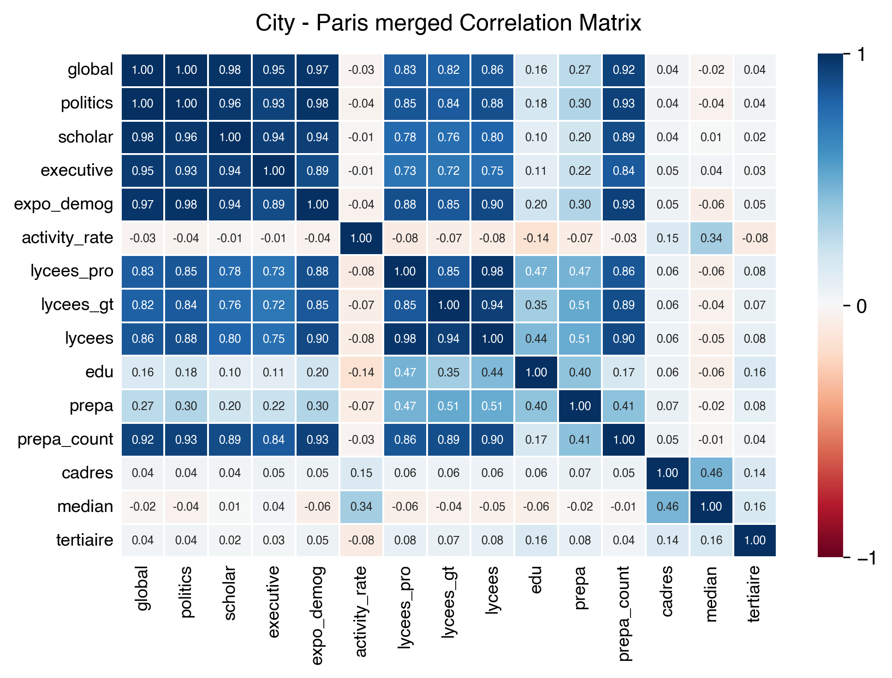
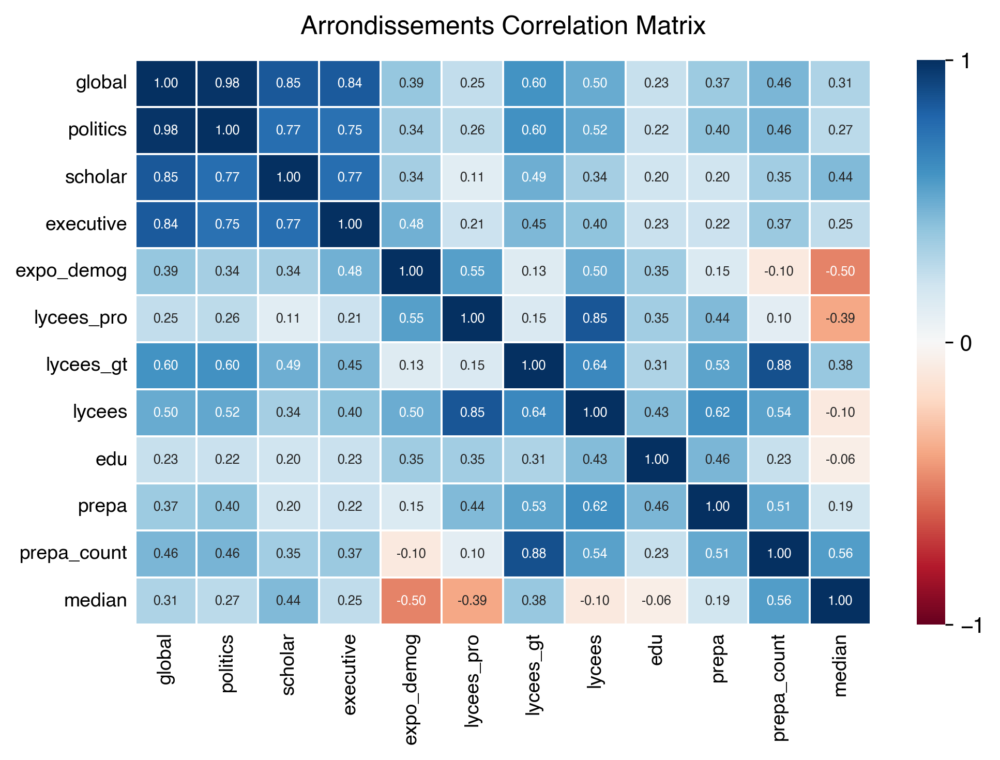

# A Prosopographical Study of French Elites Geographical Origins during the Fifth Republic

## Abstract

This research aims to map and analyse the geographical origins of French political, corporate and intellectual figures under the Fifth Republic. Using web-scraping to construct and enrich a comprehensive biographical database of 5722 individuals, we quantify geographical hubs by cross-referencing our data with demographic and economic factors from INSEE. Our scope ranges from aggregated regions to Parisian arrondissements. Our results highlight a Parisian dominancy and identify significant geographical outliers (overperformers like Neuilly-sur-Seine and underperformers like Colombes) through multivariate OLS regressions.

## Introduction

While the role of social origin [1] and education [2] in the making of elites is a well documented theme in French sociology, the geographical origin of these individuals is often treated as a secondary variable. This project seeks to find which parts of the french territory produces the most elites, and understand the way demographic and economic factors (poverty rate, median income) drive this production.

This project was conceived to master automated scraping of public sources, and was also driven out of curiosity to settle a familial debate. Using public sources (Wikipedia, National Assembly Sycomore, Pappers, data.gouv.fr, INSEE) we build a dataset using the place of birth (```pob```) as a common variable. We focus on three clusters of individuals: political (englobing presidents, ministers, Parliament members and senators), scholars (professors of the Collège de France) and corporate (executives, administrators and board members of CAC40 companies). 

We limit the period of study to the Fifth republic, in order to ensure that economic and demographic characteristics remain broadly in line with the contemporary picture, but also to avoid any issue with geographical nomenclature. Geographically, we only analyse mainland France, and all DOMs except Mayotte. These constraints stem from data availability limits from INSEE. 

[1] *Bourdieu & Passeron, Les Héritiers. Bourdieu & Passeron, La Reproduction. Gavras, Les Bonnes Conditions.*
[2] *Benveniste & Pavie, Elites: origin, education, destination. Benveniste, Noble Lineage and the Persistance of Privileges in Elite Education.*

## Data Acquisition and Methodology

The ```fetch``` folder of this repository is dedicated to data acquisition. We follow a strict ```src```, ```interim```, ```out``` data pipeline. ```utils``` shares heuristics for Wikipedia scraping, geolocation and arrondissement finding.

As previously stated, our study focuses on six categories : ```parliament```, ```senat```, ```minister```, ```president```, ```college_de_france``` and ```executive```.  For each of these individuals, we need to obtain their : ```name```, ```tag```, ```pob```, ```dob``` (date of birth), ```department```, ```dept_num```, ```region```, ```lon```, ```lat```. Each cohort presented different data obtention challenges, that had to be overcome with dedicated methods.

Presidential data was manually obtained for testing purposes.

### ```fetch/parliament```

No database of all Parliament Members of the Fifth Republic is publicly downloadable. The main reference is the [National Assembly Sycomore](https://www2.assemblee-nationale.fr/sycomore/recherche) whose search engine is publicly available with customisable settings. However, the pagination of this outdated website struggles to display all 4555 deputes of the Fifth Republic, only showing the first 500 results.

To bypass the 500-result limit, we extract the HTML encoding of departments of the search engine (```src/departments_raw.txt```, in which we encounter former french colonies such as Gabon and Oubangui-Chari-Tchad) and implement a department-by-department recursive query so as never to exceed the functional pagination limit. We extract the name and hyperlink id of each depute found in this process. 

From this list of ids, we scrape thousands of biographical profiles on the National Assembly website, from which we can easily extract the place and date of birth of Parliament members. These profiles are standardised and well-documented: we have full data for 4539 individuals. We enrich this data using [geo.api.gouv.fr](https://geo.api.gouv.fr) with multithreading to find the department, department number, region and GPS coordinates of each place of birth.

For Parisian deputes, we need to obtain the arrondissement where they were born. We use BeautifulSoup for Wikipedia scraping (in categories, infobox and introductory paragraph) to find their precise arrondissement of birth. The reliability of this method relies on the integrity of wikipedia data. For 365 Parisian places of birth, we have a 68.4% recovery rate.

After a manual cleaning, ```out/an_clean.csv``` contains a clean list for 4539 National Assemble members.

[3] *This [data.gouv.fr dataset](https://www.data.gouv.fr/datasets/fichier-historique-des-deputes-et-de-leurs-mandats) produced by the National Assembly only goes up to 1997.  We dont use the [BRÉF database](https://zenodo.org/records/14628510) : while it contains data for 3266 senate members, it only has data for 2 500 National Assembly Members.*


### ```fetch/senators```

We use the [General Informations on Senator](https://data.senat.fr/les-senateurs/) database published by the French Senate, from which we obtain ```name``` and ```dob``` for 1944 senators. 

We use this list to obtain their ```pob``` using Wikipedia scraping. In order to find the correct profile, we try various thematic URL suffixes and different arrangements for compound names to ensure high match rates. With then check for specific thematic keywords on the page before extracting any data. 

After checking for arrondissements and enriching our data with [geo.api.gouv.fr](https://geo.api.gouv.fr), ```out/sn_clean.csv```contains a clean list for 1477 senators.

### ```fetch/ministers```

For ministers, we decided to use this [unofficial list of all ministers of the Fifth Republic](http://www.histoire-france-web.fr/Documents/ministres.htm) . It would also have been possible to navigate within the [List of French Governments](https://fr.wikipedia.org/wiki/Liste_des_gouvernements_de_la_France) Wikipedia page tree structure, but finding an unified dataset solved this issue.

We proceed with the same Wikipedia scraping, arrondissements check and enrichment with geographic data. ```out/mn_clean.csv``` contains clean data for 430 ministers. 


### ```fetch/scholars```

We rely on the [Historical List of Chairs at the Collège de France](https://www.college-de-france.fr/fr/actualites/liste-historique-des-chaires-du-college-de-france) database maintained by the Collège de France. We keep all chairs that were ongoing during the Fifth Republic, even if they started earlier. We do our usual Wikipedia web-scraping, this time with academia-related keywords and suffixes, before enriching our dataset with geo data. 

Many professor at the Collège de France were born abroad. As a result, ```out/cf_clean.csv``` only contains data for 182 scholars. This is insufficient for proper thematic analysis. Hence, we scrap Wikipedia's [French Scholars](https://fr.wikipedia.org/wiki/Cat%C3%A9gorie:Universitaire_fran%C3%A7ais_du_XXe_si%C3%A8cle) category to further enrich our dataset, raising the total of scholars to 407. This is still a low amount of individuals for proper statistical analysis. 


### ```fetch/executives```

There isn't any unified list of CEOs and top executives of all CAC40 companies. In order to define the scope of companies we focus on, we use this amateur dataset: [A complete history of the CAC 40’s composition](https://www.bnains.org/archives/histocac/histocac.php). ```src/cac_list.txt``` contains manually obtained URLs of the Pappers pages of companies that are or were once in the CAC40 and still have a sufficient scale in activities.

From this list of URLs, we a Selenium Chrome scraper to extract the names of top executives and administrators of these companies from Pappers. From this list of names, we use our usual Wikipedia scraping and geo enrichment method.

Most of these executives aren't public personalities: they might have a biographical page on their company's website, but don't have a Wikipedia page. From the 1340 names we found on Pappers, we could only find a correct wikipedia page for 406 of them. Moreover, an important fraction of them are born abroad. As a result, we only have 232 exploitable individuals in the executives category.

To further populate this category, we scrap Wikipedia's [French CEOs](https://fr.wikipedia.org/wiki/Cat%C3%A9gorie:Chef_d%27entreprise_fran%C3%A7ais) and [French Business Personalities](https://fr.wikipedia.org/wiki/Cat%C3%A9gorie:Personnalit%C3%A9_fran%C3%A7aise_du_monde_des_affaires_du_XXIe_si%C3%A8cle) categories. This raises the total of executives to 603.

### ```fetch/merging```

When merging all the clean datasets we obtained, we handle career progression (e.g. a Senator becoming a Minister) by applying a strict tag hierarchy highlighting cohorts with fewer observations : ```president > minister > college_de_france > executive > senator > depute```. After this process, ```interim/merged_raw.csv``` contains 6951 individuals, but there are still a lot of issues. 

We still have to manually have to clean this raw data. Here is a non-exhaustive list of issues that have been resolved : 
- Foreign born individuals that were still in the dataset.
- Individuals born in overseas collectivities and overseas territory
- Individuals born before 1870, a symptom of Wikipedia matching failure.
- Individuals born in foreign cities with French homonyms that were identified as French cities by our algorithm.
- Correcting names of municipalities that have ceased to exist or have been merged into new municipalities.
- Wrong municipality and department association because of homonyms.
- Wrong department and region association.

After this manual cleaning, we are left with clean geographical data for 5722 individuals. 

| Category    | Sub-category     | Headcount | % of the total | Sources                      |
| ----------- | ---------------- | --------- | -------------- | ---------------------------- |
| *Political* | ```parliament``` | 3590      | 55.23%         | Sycomore, Wikipédia          |
| *Political* | ```senat```      | 1280      | 19.69%         | Sénat, Wikipédia             |
| *Political* | ```ministers```  | 430       | 6.61%          | Autre, Wikipédia             |
| *Political* | ```president```  | 8         | 0.1%           | Wikipédia                    |
| *Scholars*  | ```scholar```    | 589       | 9.06%          | Collège de France, Wikipédia |
| *Corporate* | ```executive```  | 603       | 9.27%          | Pappers, Wikipédia           |
| **Global**  |                  | **6500**  | **100%**       |                              |


## Analysis

In ```/analysis```, we analyse our clean dataset with rankings, maps and multivariate regressions using INSEE data.

### Exogenous data sources

Our analysis is based on both demographic and economic data.

For demographic data, we use INSEE's [History of municipal populations - 1876 - 2023 population censuses](https://www.insee.fr/fr/statistiques/3698339Historique) dataset (```src/base-pop-historiques-1876-2023.xlsx```). These historical censuses are not conducted at regular intervals. Therefore, we group them by calculating the average of each decade from 2009 to the beginning of the 20th century. There are no records for the decade 1940-1949 : we use the average of the previous and following decade. Data is missing before the 1940s for some cities. We use a simple but approximative solution for them: estimating population growth at 5% per decade based on the most recent census. Finally, to avoid comparing a 1940 birth to 2023 population figures, we create a demographic exposure index (```expo_demog```) giving us a unique number per geographical entity:
$$\text{expo}\_\text{demog} = \sum (\text{Population}_{\text{decade}} \times \text{Weight}_{\text{decade}})$$
Where: 
- $\text{Population}_\text{decade}$ is the average municipal population for a given decade of birth
- $\text{Weight}_{\text{decade}}=\frac{n_\text{born in decade}}{N_\text{total}}$ (share of elites in our dataset born during that period)

For economic data, we need various type of data. For the regional scale, we use INSEE's [Standard of living and poverty by region](https://www.insee.fr/fr/statistiques/7941411?sommaire=7941491) dataset (```src/RPM2024-F21.xlsx```) to obtain both median income and poverty rate. For the departmental scale, we use the same source for the poverty rate and for the median income of Guadeloupe and Guyane. For the median income of other departments, we rely on DREES's [2023 Statistical Overview](https://data.drees.solidarites-sante.gouv.fr/explore/dataset/panorama-statistique-toutes-thematiques/information/). For municipalities, we can only obtain the median income from Geoptis's 2021 [Income of the French at the municipal scale](https://www.data.gouv.fr/datasets/revenu-des-francais-a-la-commune). For various data at each scale (population density, composition of employment, shares of diploma holders, etc.), we rely on the [Territory Observatory database](https://www.observatoire-des-territoires.gouv.fr/outils/cartographie-interactive/#bbox=-211484,6329234,794317,830849&c=indicator&selcodgeo=95176&view=map76). 

For educational data, we rely on INSEE's [Secondary schools at the start of the 2024 academic year](https://www.insee.fr/fr/statistiques/2012787#tableau-TCRD_061_tab1_regions2016) to find out the number of secondary schools per level and domain (professional and general) per region and department. For municipal count, we use the list of secondary schools from the 2024 Ministry of Higher Education, Research and Space [Student enrolment figures for higher education institutions and courses](https://data.enseignementsup-recherche.gouv.fr/explore/assets/fr-esr-atlas_regional-effectifs-d-etudiants-inscrits/). For the count of preparatory classes, we use the Ministry of Higher Education, Research and Space's [Number of students enrolled in preparatory classes for the grandes écoles](https://data.enseignementsup-recherche.gouv.fr/explore/assets/fr-esr-atlas_regional-effectifs-d-etudiants-inscrits-detail_etablissements/export/) dataset. We use two variables : a binary one to account for the rarity of classes préparatoires, and a log one accounting for the amount of cursus in these classes. 

We use ```cross_sourcing.py``` to combine the count of personalities with demographic and economic data for each geographical scale. Cities with the same name are distinguished by matching the department number. We use fuzzy matching with a 85% threshold to allow matches despite minor differences with the official INSEE nomenclature. 


### Rankings

When observing our dataset on the regional scale (Figure 1), we notice that the region Île de France is by far leading the personalities count. This region is by far the most populated of the country, counting 12.38 million inhabitants in 2025 whereas Auvergne-Rhône-Alpes, the second most populous region, had a population of just 8.16 million according to [INSEE](https://www.insee.fr/fr/statistiques/8290644?sommaire=8290669). In fact, this ranking mostly follows the population ranking of regions for the global cohort. The only notable exception is Hauts-de-France: ranked 5th in terms of population, it comes 3rd on the global ranking. Even tough the 3rd, 4th and 5th regions of the demographic ranking have similar populations (less than 100 000 inhabitants distinguish them), this result indicates that the correlation between population and the number of prominent figures isn't 1.

On the global scale, the top 3 regions accounts for 40.8% of all personalities, and the top 5 for 59.3%. This dominancy of the top 3 is more emphasized for executives and scholars, representing respectively 57.1% and 64.4% of the total count.

For the ranking of departments (Figure 2), the lead of Paris is even more pronounced across all categories. On the global scale, the top 3 departments account for 19.3% of the total count, while the top 10 accounts for 33.9%, a noticeable share out of 100 departments.

**Figure 1: Ranking of personalities count per region** 


**Figure 2: Ranking of personalities count per department**


When ranking cities (Figure 3), the podium is to be expected: Paris, Lyon and Marseille are the three most important cities of the country. However, it is surprising to find Neuilly-sur-Seine on the fourth step of the global ranking. Despite being almost ten times smaller than Toulouse (in 2022, the latter had [511 684 inhabitants]((https://www.insee.fr/fr/statistiques/2011101?geo=COM-31555) while Neuilly-sur-Seine only had [59 200](https://www.insee.fr/fr/statistiques/2011101?geo=COM-92051)), it produces more elites on a global basis. 

Toulouse, with its median income of €22,140 and 63 prominent figures, offers the best ratio of wealth to elite production. Gérard Bailly, a senator for Jura from 2001 to 2017, was born in Uxelles in 1940 when the town had a population of just 75; he is the elected representative from the smallest town in our sample. At the other end of the spectrum is Colombes, which has only one elected representative despite having 91,053 inhabitants in 2023.

For executives, the over-representation of affluent western Parisian suburbs questions the role played by the geographical concentration of economic capital. Merging all arrondissements as "Paris" (Figure 4) highlights the impressive ranking of the country's capital, [a well studied historical case](https://books.openedition.org/psorbonne/868#anchor-resume). The ranking of Parisian arrondissements (Figure 5) shows that over half (51.6%) of the global personalities come from five arrondissements out of twenty.

**Figure 3: Ranking of personalities count per city** 


**Figure 4: Ranking of personalities count per city (Paris merged)** 


**Figure 5: Ranking of personalities count per arrondissement**


These rankings, with peculiar cases like that of Neuilly-sur-Seine, questions the weight of demographic factors in elite production and underlines the need for other factors (economics) for a thorough analysis.


### Maps

A bubble map per category (Figure 6) gives a macro perspective of elites origins in mainland territories. DOMs aren't included at the moment. Visually, we notice a high concentration around Paris and it's peripheral municipalities. Contrary to others, the Nord department distinguishes itself by having multiple mid-size clusters instead of one large city from which many elites come from. We recognise the weight of large cities : Paris, Lyon, Marseille, Toulouse, Strasbourg. We also notice a high concentration along the south-east coastline of the country.

**Figure 6: Bubble map of elites origins per category in mainland France**


On a regional choropleth map (Figure 7), the influence of the Île-de-France region is particularly evident. On a departmental scale (Figure 8), highlighted departments are those that include major cities: Nord (Lille), Rhône (Lyon), Bouches-du-Rhône (Marseille). At the municipal level (Figure 8), is is apparent that cities of origin are distributed evenly across the territory when intensity is disregarded. Finally, plotting a map per Parisian arrondissement shows the intensity of the West and South of Paris, whereas the North-East is less represented in the dataset.

**Figure 7: Choropleth map of elites origins per category on a regional scale in mainland France**


**Figure 8: Choropleth map of elites origins per category on a departmental scale in mainland France**


**Figure 9: Choropleth map of elites origins per category on a municipal scale in mainland France**


**Figure 10: Choropleth map of elites origins per category for Parisian arrondissements**


### Regressions

In order to go beyond a simple visual analysis, we use multivariate linear regressions to examine the role of demographic and economic factors in the origins of elites. First of all, we check the correlations between our variables.

On a regional scale (Figure 11), most categories of personalities are highly positively correlated together, and poverty rate show a negative correlation across all variables. This negative effect of the poverty rate is significantly reduced at the departmental scale (Figure 12), albeit the correlation remains neutral or slightly negative. Between the city dataset (Figure 13) and the paris merged dataset (Figure 14), correlation increases across all categories, and the correlation with median income goes from slightly positive to neutral and negative. For Paris arrondissements (Figure 15), our demographic exposure index is negatively correlated to the median income: we except the income the decrease as the population increase. 

**Figure 11: Correlation matrix heatmap for factors at the regional scale**


**Figure 12: Correlation matrix heatmap for factors at the departmental scale**


**Figure 13: Correlation matrix heatmap for factors at the city scale**


**Figure 14: Correlation matrix heatmap for factors at the city scale (Paris merged)**


**Figure 15: Correlation matrix heatmap for factors per Parisian arrondissement**


We run log-linear multivariate regressions modeling the probability of producing an elite member base on geographical median income, poverty rate, and demographic exposure index. 

On a regional scale and for the global cohort (Appendix 1), our model as a high R-squared (0.961), but most variables are insignificant and the small sample size (17) carries a risk of overfitting. Only the demographic index is significant ($***$), with a positive coefficient (0.8477) : an increase in population increases the probability of producing elites. Because of the poor performance of this regional model across all categories, we cannot define expected counts, underperformers and overperformers with confidence.

The departmental scale, with its 100 entities, offers a perfect trad-off between the case-by-case nature of municipal data and the over-aggregated aspect of regional data. For the global regression (Appendix 1), all factors are significant ($*** \quad \text{and}\quad *$ ) with a R-squared of 0.783. The demographic index has the same 0.8 coefficient, and the median income is even more correlated to elite production (1.3) (Figure 16). However, the poverty rate also has a 0.92 significant coefficient. This is a paradoxal result: the more elites come from a department the higher the median income, but also the higher the poverty rate. This could arise from high inequalities in richer departments, since areas of wealth production (Paris, Lyon) are also those that attract or create high levels of poverty, leading to a certain degree of social polarisation. The coefficient of median income increases for scholars (2.14) and executives (5.12).

**Figure 16: Departmental scatter plot, global category, median variable**

On a global basis, overperformers include Guyane (21 observed, 8.1 expected), Hauts-de-Saine (239 observed, 124.9 expected) and Paris (596 observed, 343.9 expected), but also Corse-du-Sud and Doubs. Underperformers include departments such as Seine-Saint-Denis (58 observed, 120.1 expected), Orne (17 observed, 35.5 expected), Jura, Ardèche and Aube (Figure 17). In fact, Seine-Saint-Denis is the first underperformer in three out of four categories. Despite the low R-squared of our executives models (0.514), the Hauts-de-Seine departments is an impressive outlier: 55 executives were observed when only 9.3 were expected.

**Figure 17: Departmental scatter plot, global category, expo_demog variable**

At the city scale (Appendix 3), both the demographic index and the median income are significant ($***$) but the R-squared , at around 0.5 for global and politics and 0.1 for scholars and executives. We observe this limited explanatory power with Paris being merged and for arrondissements. This can be explained by the wide variety of entities observed, but also due to the absence of the poverty rate variable in this dataset. With Paris merged, in over-performing cities on the global scale, we find Neuilly-sur-Seine (78 observed, 5.8 expected), Boulogne-Billancourt (62 observed, 6 expected), but also Toulouse, Strasbourg and Nantes. 

At the city scale, We divide our dataset into the first quantile and the remaining nine quantiles. Out of 34,000 municipalities, there is a huge number of ‘small’ municipalities that have no sixth-form colleges, no preparatory classes, no senior managers, and no leaders. This ‘masks’ the statistical relationships that we would observe at departmental level. To ensure that these socio-economic variables (managers, median, activity_rate) retain their meaning, we must therefore compare like with like. A village of 200 inhabitants does not follow the same rules as a town of 50,000.

{analyse du Q1}

For the rest of the dataset, regardless of how we arrange our explanatory variables, our model never explains more than 20% of the observations. This is significant in itself: it seems that in small towns, the emergence of a leader is a random phenomenon, or is linked to factors not captured by INSEE’s socio-economic metrics: for example a particular family or an exceptional teacher. The statistical laws governing geographical wealth and educational infrastructure only apply once a certain critical mass is reached, as analysed via the first quantile.


**Figure 18: City scatter plot, global category, expo_demog variable**


## Conclusion

### Results

Our study confirms that while France is a an ["indivisible, secular, democratic and social Republic"](https://www.legifrance.gouv.fr/loda/article_lc/LEGIARTI000019240997/2022-01-22), the origin of its elites is geographically concentrated. Paris exceeds the level of elite production expected given its population and economy, highlighting the significance of other factors such as the concentration of *Grandes Écoles*, political power, [symbolic, social and cultural capital](https://books.openedition.org/psorbonne/868). The role of economic capital is underlined by the results found with the Hauts-de-Seine department, and cities such as Neuilly-sur-Seine and Boulogne-Billancourt. Underperforming departments in elites origins, such as Jura, Haute-Marne or Orne, seems to reflect the "peripheral France" concept described by [Christophe Guilluy](https://shs.cairn.info/la-france-peripherique-comment-on-a-sacrifie-les-classes-populaires--9782081347519?lang=fr). However, our study does not support this dichotomous view of France. There are, of course, disparities and inequalities across the country, with extreme and peculiar cases, but geographical origin is not an insurmountable barrier, given the wide variety of cases observed. It is therefore easier to understand why geographical origin is a secondary factor in the analysis of the French elite. Other factors, such as social background, appear to be of greater significance.

### Limits
Our study has a number of limitations. Firstly, we only perform regressions for departments and towns for which we have data on individuals. Whilst this allows us to identify overperforming areas, the model training is biased and cannot actually identify underperforming areas, as it is unaware of the characteristics of geographical entities that haven't produced elites yet. Furthermore, the biographical data we obtain from Wikipedia is highly biased. There is a significant ‘notoriety effect’: our study does not focus on elites in the broadest sense, but on elites who have a public digital footprint. Due to our imperfect scraping methods, our dataset is likely missing a significant number of people (for example, we do not have the place of birth for over 1,000 National Assembly member) and we cannot draw any meaningful conclusions from incomplete data. The same problem arises with executives and academics: our definition of this category is too narrow, we struggle to find the information we’re looking for, and we’re unable to carry out a proper analysis of this data.

### Sources

**Literature**
[1] *Bourdieu & Passeron, Les Héritiers. Bourdieu & Passeron, La Reproduction. Gavras, Les Bonnes Conditions.*
[2] *Benveniste & Pavie, Elites: origin, education, destination. Benveniste, Noble Lineage and the Persistance of Privileges in Elite Education.*
[a well studied historical case](https://books.openedition.org/psorbonne/868#anchor-resume)
["indivisible, secular, democratic and social Republic"](https://www.legifrance.gouv.fr/loda/article_lc/LEGIARTI000019240997/2022-01-22)
[symbolic and cultural capital](https://books.openedition.org/psorbonne/868)
[Christophe Guilluy](https://shs.cairn.info/la-france-peripherique-comment-on-a-sacrifie-les-classes-populaires--9782081347519?lang=fr)

**Data**
[National Assembly Sycomore](https://www2.assemblee-nationale.fr/sycomore/recherche)
[59 200](https://www.insee.fr/fr/statistiques/2011101?geo=COM-92051)
[511 684 inhabitants]((https://www.insee.fr/fr/statistiques/2011101?geo=COM-31555)
[INSEE](https://www.insee.fr/fr/statistiques/8290644?sommaire=8290669)
[Income of the French at the municipal scale](https://www.data.gouv.fr/datasets/revenu-des-francais-a-la-commune)
[2023 Statistical Overview](https://data.drees.solidarites-sante.gouv.fr/explore/dataset/panorama-statistique-toutes-thematiques/information/)
[Standard of living and poverty by region](https://www.insee.fr/fr/statistiques/7941411?sommaire=7941491)
[History of municipal populations - 1876 - 2023 population censuses](https://www.insee.fr/fr/statistiques/3698339Historique)
[A complete history of the CAC 40’s composition](https://www.bnains.org/archives/histocac/histocac.php)
[Historical List of Chairs at the Collège de France](https://www.college-de-france.fr/fr/actualites/liste-historique-des-chaires-du-college-de-france)
[List of French Governments](https://fr.wikipedia.org/wiki/Liste_des_gouvernements_de_la_France)
[unofficial list of all ministers of the Fifth Republic](http://www.histoire-france-web.fr/Documents/ministres.htm) 
[General Informations on Senator](https://data.senat.fr/les-senateurs/)
[BRÉF database](https://zenodo.org/records/14628510)
[data.gouv.fr dataset](https://www.data.gouv.fr/datasets/fichier-historique-des-deputes-et-de-leurs-mandats) 
[geo.api.gouv.fr](https://geo.api.gouv.fr)
[Number of students enrolled in preparatory classes for the grandes écoles](https://data.enseignementsup-recherche.gouv.fr/explore/assets/fr-esr-atlas_regional-effectifs-d-etudiants-inscrits-detail_etablissements/export/)
[Student enrolment figures for higher education institutions and courses](https://data.enseignementsup-recherche.gouv.fr/explore/assets/fr-esr-atlas_regional-effectifs-d-etudiants-inscrits/)
[Secondary schools at the start of the 2024 academic year](https://www.insee.fr/fr/statistiques/2012787#tableau-TCRD_061_tab1_regions2016) 
[Territory Observatory database](https://www.observatoire-des-territoires.gouv.fr/outils/cartographie-interactive/#bbox=-211484,6329234,794317,830849&c=indicator&selcodgeo=95176&view=map76)
[French Business Personalities](https://fr.wikipedia.org/wiki/Cat%C3%A9gorie:Personnalit%C3%A9_fran%C3%A7aise_du_monde_des_affaires_du_XXIe_si%C3%A8cle)
[French CEOs](https://fr.wikipedia.org/wiki/Cat%C3%A9gorie:Chef_d%27entreprise_fran%C3%A7ais)
[French Scholars](https://fr.wikipedia.org/wiki/Cat%C3%A9gorie:Universitaire_fran%C3%A7ais_du_XXe_si%C3%A8cle)


**Appendix 1: Regional linear regression | log(global) ~ log(expo_demog) + log(prepa_rate)**
```
                            OLS Regression Results                            
==============================================================================
Dep. Variable:                 global   R-squared:                       0.966
Model:                            OLS   Adj. R-squared:                  0.962
Method:                 Least Squares   F-statistic:                     201.1
Date:                Thu, 02 Apr 2026   Prob (F-statistic):           4.88e-11
Time:                        12:23:52   Log-Likelihood:                 2.1800
No. Observations:                  17   AIC:                             1.640
Df Residuals:                      14   BIC:                             4.140
Df Model:                           2                                         
Covariance Type:            nonrobust                                         
==============================================================================
                 coef    std err          t      P>|t|      [0.025      0.975]
------------------------------------------------------------------------------
const         -6.6146      0.720     -9.187      0.000      -8.159      -5.070
expo_demog     0.8324      0.046     18.117      0.000       0.734       0.931
prepa_rate     2.6457      1.067      2.479      0.026       0.357       4.934
==============================================================================
Omnibus:                        2.801   Durbin-Watson:                   1.599
Prob(Omnibus):                  0.247   Jarque-Bera (JB):                1.136
Skew:                           0.579   Prob(JB):                        0.567
Kurtosis:                       3.511   Cond. No.                         298.
==============================================================================

Notes:
[1] Standard Errors assume that the covariance matrix of the errors is correctly specified.
```

**Appendix 2: Departmental linear regression | log(global) ~ log(expo_demog) + log(prepa_rate) + log(cadres_and_pro) + log(poverty_rate)**
```                            OLS Regression Results                            
==============================================================================
Dep. Variable:                 global   R-squared:                       0.838
Model:                            OLS   Adj. R-squared:                  0.831
Method:                 Least Squares   F-statistic:                     122.6
Date:                Thu, 02 Apr 2026   Prob (F-statistic):           1.27e-36
Time:                        12:23:52   Log-Likelihood:                -5.9039
No. Observations:                 100   AIC:                             21.81
Df Residuals:                      95   BIC:                             34.83
Df Model:                           4                                         
Covariance Type:            nonrobust                                         
==================================================================================
                     coef    std err          t      P>|t|      [0.025      0.975]
----------------------------------------------------------------------------------
const             -7.4193      0.790     -9.391      0.000      -8.988      -5.851
expo_demog         0.7798      0.047     16.568      0.000       0.686       0.873
prepa_rate         2.0663      0.484      4.273      0.000       1.106       3.026
cadres_and_pro     0.2504      0.081      3.103      0.003       0.090       0.411
poverty_rate       0.2547      0.115      2.207      0.030       0.026       0.484
==============================================================================
Omnibus:                        3.209   Durbin-Watson:                   2.266
Prob(Omnibus):                  0.201   Jarque-Bera (JB):                3.262
Skew:                           0.091   Prob(JB):                        0.196
Kurtosis:                       3.866   Cond. No.                         425.
==============================================================================

Notes:
[1] Standard Errors assume that the covariance matrix of the errors is correctly specified.
```

**Appendix 3: City linear regression | log(global) ~ log(expo_demog) + log(tertiaire) + log(lycees_gt) + log(prepa_count)**
```
                            OLS Regression Results                            
==============================================================================
Dep. Variable:                 global   R-squared:                       0.619
Model:                            OLS   Adj. R-squared:                  0.619
Method:                 Least Squares   F-statistic:                     1409.
Date:                Thu, 02 Apr 2026   Prob (F-statistic):               0.00
Time:                        12:23:53   Log-Likelihood:                -2030.6
No. Observations:                3468   AIC:                             4071.
Df Residuals:                    3463   BIC:                             4102.
Df Model:                           4                                         
Covariance Type:            nonrobust                                         
===============================================================================
                  coef    std err          t      P>|t|      [0.025      0.975]
-------------------------------------------------------------------------------
const          -3.6789      0.179    -20.588      0.000      -4.029      -3.329
expo_demog      0.4371      0.013     33.444      0.000       0.411       0.463
tertiaire       0.0859      0.040      2.148      0.032       0.008       0.164
lycees_gt       0.2665      0.022     11.919      0.000       0.223       0.310
prepa_count     0.1881      0.017     10.968      0.000       0.154       0.222
==============================================================================
Omnibus:                      243.106   Durbin-Watson:                   1.946
Prob(Omnibus):                  0.000   Jarque-Bera (JB):              428.287
Skew:                           0.517   Prob(JB):                     9.97e-94
Kurtosis:                       4.376   Cond. No.                         234.
==============================================================================

Notes:
[1] Standard Errors assume that the covariance matrix of the errors is correctly specified.
```